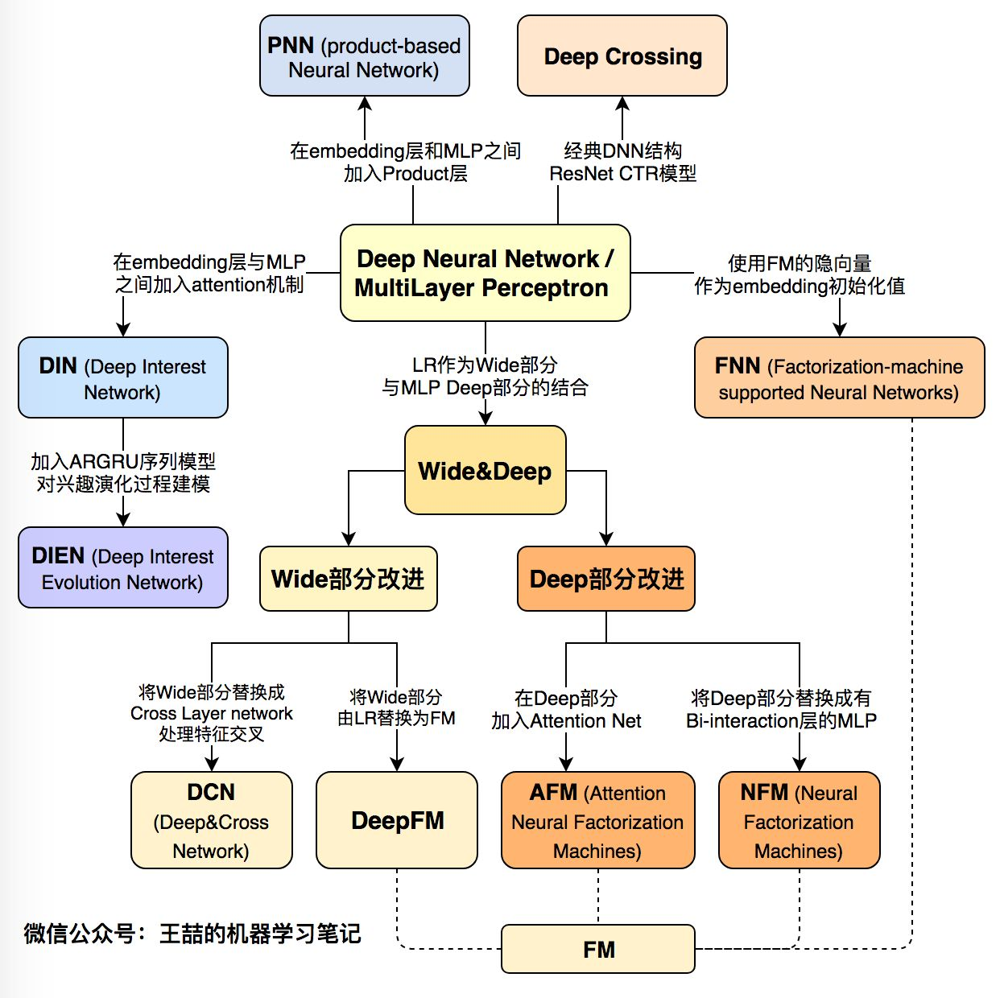

# rater

**rater** is a comparative framework for multimodal recommender systems. It was developed to facilitate the designing, comparing, and sharing of recommendation models.

## Feature

* easy to use, rebuild and compare
* SOTA model
* classical model and deep model
* model has great influence in the industry
* model hsa been successfully applied by Google, Alibaba, Baidu and other well-known companies
* engineering oriented, not just experimental data validation


## Data

1. ml-1m: http://files.grouplens.org/datasets/movielens/ml-1m.zip
2. delicious-2k: http://files.grouplens.org/datasets/hetrec2011/hetrec2011-delicious-2k.zip
3. lastfm-dataset-360K: http://mtg.upf.edu/static/datasets/last.fm/lastfm-dataset-360K.tar.gz
4. slashdot: http://snap.stanford.edu/data/soc-Slashdot0902.txt.gz
5. epinions: http://snap.stanford.edu/data/soc-Epinions1.txt.gz
6. ml-100k: http://files.grouplens.org/datasets/movielens/ml-100k.zip
7. Criteo(dac full): https://s3-eu-west-1.amazonaws.com/kaggle-display-advertising-challenge-dataset/dac.tar.gz
8. Criteo(dac sample): http://labs.criteo.com/wp-content/uploads/2015/04/dac_sample.tar.gz

## Install
```
pip3 install rater
```

or

```
git clone https://github.com/shibing624/rater.git
cd rater
python3 setup.py install
```

## Usage


Load the built-in [MovieLens 1M](https://grouplens.org/datasets/movielens/1m/) dataset (will be downloaded if not cached):


**Output:**

|                          |    MAE |   RMSE |    AUC | NDCG@10 | NDCG@20 | Recall@10 | Recall@20 |  Train (s) | Test (s) |
| ------------------------ | -----: | -----: | -----: | ------: | ------: | --------: | --------: | ---------: | -------: |
| [MF]  | 0.7430 | 0.8998 | 0.7445 |  0.0479 |  0.0556 |    0.0352 |    0.0654 |       0.13 |     1.57 |
| [PMF] | 0.7534 | 0.9138 | 0.7744 |  0.0617 |  0.0719 |    0.0479 |    0.0880 |       2.18 |     1.64 |
| [BPR] |    N/A |    N/A | 0.8695 |  0.0975 |  0.1129 |    0.0891 |    0.1449 |       3.74 |     1.49 |

For more details, please take a look at our [examples](examples).

## Models

The models supported are listed below. Why don't you join us to lengthen the list?

### Click Through Rate Prediction
| model | paper |
|:-----|:------|
|LR: Logistic Regression| [Simple and Scalable Response Prediction for Display Advertising](https://dl.acm.org/doi/pdf/10.1145/2532128?download=true)|
|FM: Factorization Machine|\[ICDM 2010\][Factorization Machines](https://dl.acm.org/doi/10.1109/ICDM.2010.127)|
|GBDT+LR: Gradient Boosting Tree with Logistic Regression|[Practical Lessons from Predicting Clicks on Ads at Facebook](https://dl.acm.org/doi/pdf/10.1145/2648584.2648589)|
|FNN: Factorization-supported Neural Network|\[ECIR 2016\][Deep Learning over Multi-field Categorical Data: A Case Study on User Response Prediction](https://dl.acm.org/doi/pdf/10.1145/2959100.2959134)|
|PNN: Product-based Neural Network|\[ICDM 2016\][Product-based neural networks for user response prediction](https://arxiv.org/pdf/1611.00144.pdf)|
|Wide and Deep|\[DLRS 2016\][Wide & Deep Learning for Recommender Systems](https://arxiv.org/pdf/1606.07792.pdf)|
|DeepFM|\[IJCAI 2017\][DeepFM: A Factorization-Machine based Neural Network for CTR Prediction](https://arxiv.org/pdf/1703.04247.pdf)|
|AFM: Attentional Factorization Machine|\[IJCAI 2017\][Attentional Factorization Machines: Learning the Weight of Feature Interactions via Attention Networks](http://www.ijcai.org/proceedings/2017/435)|
|NFM: Neural Factorization Machine|\[SIGIR 2017\][Neural Factorization Machines for Sparse Predictive Analytics](https://arxiv.org/pdf/1708.05027.pdf)|
|FFM: Field-aware Factorization Machine|\[RecSys 2016\][Field-aware Factorization Machines for CTR Prediction](https://dl.acm.org/doi/pdf/10.1145/2959100.2959134)|
|CCPM: Convolutional Click Prediction Model|\[CIKM 2015\][A Convolutional Click Prediction Model](http://ir.ia.ac.cn/bitstream/173211/12337/1/A%20Convolutional%20Click%20Prediction%20Model.pdf)|
|Piece-wise Linear Model|\[arxiv 2017\][Learning Piece-wise Linear Models from Large Scale Data for Ad Click Prediction](https://arxiv.org/abs/1704.05194)|
|DCN: Deep & Cross Network|\[ADKDD 2017\][Deep & Cross Network for Ad Click Predictions](https://arxiv.org/abs/1708.05123)|
|xDeepFM|\[KDD 2018\][xDeepFM: Combining Explicit and Implicit Feature Interactions for Recommender Systems](https://arxiv.org/pdf/1803.05170.pdf)|
|AutoInt|\[arxiv 2018\][AutoInt: Automatic Feature Interaction Learning via Self-Attentive Neural Networks](https://arxiv.org/abs/1810.11921)|
|ONN|\[arxiv 2019\][Operation-aware Neural Networks for User Response Prediction](https://arxiv.org/pdf/1904.12579.pdf)|
|FGCNN|\[WWW 2019\][Feature Generation by Convolutional Neural Network for Click-Through Rate Prediction](https://arxiv.org/pdf/1904.04447)|
|FiBiNET|\[RecSys 2019\][FiBiNET: Combining Feature Importance and Bilinear feature Interaction for Click-Through Rate Prediction](https://arxiv.org/pdf/1905.09433.pdf)|
|FLEN|\[arxiv 2019\][FLEN: Leveraging Field for Scalable CTR Prediction](https://arxiv.org/pdf/1911.04690.pdf)|


### Sequential Recommendation
| model/keywords | paper |
|:------|:------|
|GRU4Rec|Session-based Recommendations with Recurrent Neural Networks|
|Caser|Personalized Top-N Sequential Recommendation via Convolutional Sequence Embedding|
|DIN: Deep Interest Network|\[KDD 2018\][Deep Interest Network for Click-Through Rate Prediction](https://arxiv.org/pdf/1706.06978.pdf)|
|Self-Attention |Next Item Recommendation with Self-Attention|
|Hierarchical Attention |Sequential Recommender System based on Hierarchical Attention Networks|
|DIEN: Deep Interest Evolution Network|\[AAAI 2019\][Deep Interest Evolution Network for Click-Through Rate Prediction](https://arxiv.org/pdf/1809.03672.pdf)|
|DISN: Deep Session Interest Network|\[IJCAI 2019\][Deep Session Interest Network for Click-Through Rate Prediction](https://arxiv.org/abs/1905.06482)|


### Embedding Methods
| model | paper |
|:------|:------|
|node2vec|node2vec: Scalable Feature Learning for Networks|
|item2vec|ITEM2VEC: Neural item embedding for collaborative filtering|
|Airbnb embedding|Real-time Personalization using Embeddings for Search Ranking at Airbnb|
|EGES: Enhanced Graph Embedding with Side information|Billion-scale Commodity Embedding for E-commerce Recommendation in Alibaba|


#### Model Evolution


refer: https://zhuanlan.zhihu.com/p/63186101


## Contribute


Your contributions at any level of the library are welcome. If you intend to contribute, please:
  - Fork the rater repository to your own account.
  - Make changes and create pull requests.

You can also post bug reports and feature requests in [GitHub issues](https://github.com/shibing624/rater/issues).

## License

[Apache License 2.0](LICENSE)


## Reference


* [Multilayer Perceptron Based Recommendation]
* [Autoencoder Based Recommendation]
* [CNN Based Recommendation]
* [RNN Based Recommendation]
* [Restricted Boltzmann Machine Based Recommendation]
* [Neural Attention Based Recommendation]
* [Neural AutoRegressive Based Recommendation]
* [Deep Reinforcement Learning for Recommendation]
* [GAN Based Recommendation]
* [Deep Hybrid Models for Recommendation]
* [maciejkula/spotlight](https://github.com/maciejkula/spotlight)
* [shenweichen/DeepCTR](https://github.com/shenweichen/DeepCTR)
* [Magic-Bubble/RecommendSystemPractice](https://github.com/Magic-Bubble/RecommendSystemPractice)
* [nzc/dnn_ctr](https://github.com/nzc/dnn_ctr)